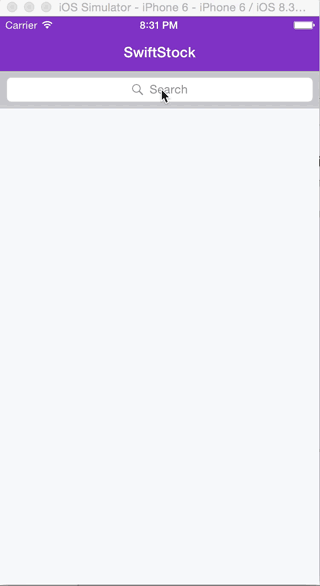

`SwiftStock` is the simplest way to add real-time <a href="http://finance.yahoo.com">Yahoo! Finance</a> stock market data to your Swift app. It's a major Swift upgrade for my previous contribution, <a href="https://github.com/ackleymi/MAStockGraph">MAStockGraph</a>. For simplicity, the example project (SwiftStockExample.xcworkspace) I built has the <a href="https://github.com/Alamofire/Alamofire">Alamofire</a> cocoapod included for networking with the Yahoo Finance APIs. Run `pod install` as usual if it complains. Please open issues on the project if you run into snags!

`SwiftStock` consists of three parts-
1) A predictive stock quote search API.
2) A comprehensive financial instrument API with all the best data points :D.
3) A charting API that yields a full set of time-and-sales data over various time frames (including the elusive intraday 😊)



## Requirements

`SwiftStock` uses Swift 2.1 with ARC and requires iOS 9.0+. It also requires Alamofire be installed.

## Installation

### Manual

Copy the swift file `SwiftStockKit` to your project.

### Cocoapods

Supported in a later update. 

## Usage

#### Quote Search

```swift
// Pass in your search term
SwiftStockKit.fetchStocksFromSearchTerm(term: searchText) { (stockInfoArray) -> () in

        // And it returns an array of results of type
        struct StockSearchResult {
		    var symbol: String?
		    var name: String?
		    var exchange: String?
		    var assetType: String?
		}

    }

```

#### Get a stock from a symbol

```swift
// Pass in your symbol
 SwiftStockKit.fetchStockForSymbol(symbol: stockSymbol) { (stock) -> () in

       //And it returns a stock object that looks like this
       struct Stock {
		    var ask: String?
		    var averageDailyVolume: String?
		    var bid: String?
		    var bookValue: String?
		    var changeNumeric: String?
		    var changePercent: String?
		    var dayHigh: String?
		    var dayLow: String?
		    var dividendShare: String?
		    var dividendYield: String?
		    var ebitda: String?
		    var epsEstimateCurrentYear: String?
		    var epsEstimateNextQtr: String?
		    var epsEstimateNextYr: String?
		    var eps: String?
		    var fiftydayMovingAverage: String?
		    var lastTradeDate: String?
		    var last: String?
		    var lastTradeTime: String?
		    var marketCap: String?
		    var companyName: String?
		    var oneYearTarget: String?
		    var open: String?
		    var pegRatio: String?
		    var peRatio: String?
		    var previousClose: String?
		    var priceBook: String?
		    var priceSales: String?
		    var shortRatio: String?
		    var stockExchange: String?
		    var symbol: String?
		    var twoHundreddayMovingAverage: String?
		    var volume: String?
		    var yearHigh: String?
		    var yearLow: String?

		    //this has everything neatly packaged to go into a datasource
		    var dataFields: [[String : String]]
		}

	}

```

#### Charting

```swift
// Pass in your symbol and chart time range (enum)
SwiftStockKit.fetchChartPoints(symbol: stockSymbol, range: range) { (chartPoints) -> () in

	    // And it returns an array of results of type
		struct ChartPoint {
		    var date: NSDate?
		    var volume: Int?
		    var open: CGFloat?
		    var close: CGFloat?
		    var low: CGFloat?
		    var high: CGFloat?

		}
		// Perfect for making candles 😊
    }

```

In the example I included a quick little swift charting library that accepts the array of ChartPoint's. Feel free to use that if you wish as well! (Bonus points for upgrading it with candles support and opening a pull request)

## To-Do
-  UI Updates to the new styles- Apple keeps changing their mind about they want autolayout to work.
-  Cocoapods / Carthage Support
-  Test coverage and CI with Travis. 
-  Bug bullet-proofing.

## License

The MIT License (MIT)

Copyright (c) 2016 Michael Ackley

Permission is hereby granted, free of charge, to any person obtaining a copy
of this software and associated documentation files (the "Software"), to deal
in the Software without restriction, including without limitation the rights
to use, copy, modify, merge, publish, distribute, sublicense, and/or sell
copies of the Software, and to permit persons to whom the Software is
furnished to do so, subject to the following conditions:

The above copyright notice and this permission notice shall be included in
all copies or substantial portions of the Software.

THE SOFTWARE IS PROVIDED "AS IS", WITHOUT WARRANTY OF ANY KIND, EXPRESS OR
IMPLIED, INCLUDING BUT NOT LIMITED TO THE WARRANTIES OF MERCHANTABILITY,
FITNESS FOR A PARTICULAR PURPOSE AND NONINFRINGEMENT. IN NO EVENT SHALL THE
AUTHORS OR COPYRIGHT HOLDERS BE LIABLE FOR ANY CLAIM, DAMAGES OR OTHER
LIABILITY, WHETHER IN AN ACTION OF CONTRACT, TORT OR OTHERWISE, ARISING FROM,
OUT OF OR IN CONNECTION WITH THE SOFTWARE OR THE USE OR OTHER DEALINGS IN
THE SOFTWARE.
